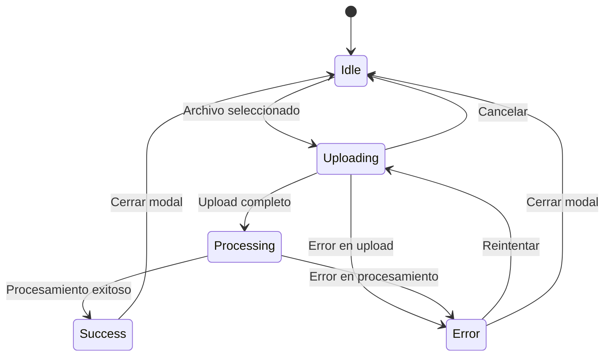

# 📤 Sistema de Upload Chunked - Implementación Completa

## 🚀 Funcionalidades Implementadas

### ✅ 1. Upload Chunked con Progreso Detallado
- **Progreso en porcentaje**: Muestra el progreso real de subida con información detallada
- **Información de velocidad**: Calcula y muestra la velocidad de upload en tiempo real  
- **Tiempo restante**: Estima el tiempo restante basado en la velocidad actual
- **Progreso por chunks**: Muestra cuántos chunks se han subido vs el total
- **Estadísticas detalladas**: Bytes subidos, total, chunks procesados

### ✅ 2. Cancelación de Upload
- **Botón de cancelar**: Permite cancelar el upload en cualquier momento durante la subida
- **Limpieza automática**: Cancela todas las requests pendientes y limpia archivos temporales
- **Estado consistente**: El sistema vuelve al estado inicial después de cancelar

### ✅ 3. Manejo de Casos Fallidos con Reintentar
- **Detección de errores**: Identifica y muestra errores específicos durante la subida
- **Botón "Reintentar"**: Permite reintentar la subida manteniendo el archivo seleccionado
- **Reintentos automáticos**: Sistema de reintentos automáticos para chunks individuales
- **Estados de error claros**: Muestra información específica sobre el error ocurrido

## 🏗️ Arquitectura Implementada

### Componentes Principales

1. **`ChunkedUploadButton`** (`/src/components/shared/ChunkedUploadButton.tsx`)
   - Componente React avanzado para upload con chunks
   - Compatible con el `UploadButton` original 
   - Interfaz mejorada con información detallada de progreso

2. **`chunkedUploadService`** (`/src/services/chunkedUpload.service.ts`)
   - Servicio para manejo de uploads por chunks
   - Gestión de sesiones de upload
   - Control de cancelación y reintentos

3. **`useChunkedDocumentUpload`** (`/src/hooks/useChunkedDocumentUpload.ts`)
   - Hook personalizado para integración con el sistema de documentos
   - Manejo del procesamiento post-upload
   - Funciones de control y estadísticas

### Estados del Upload

```typescript
type UploadPhase = 'idle' | 'uploading' | 'processing' | 'success' | 'error';
```

- **idle**: Estado inicial, esperando selección de archivo
- **uploading**: Subiendo archivo por chunks con progreso detallado
- **processing**: Procesando documento (texto, chunks, embeddings)
- **success**: Upload y procesamiento completados exitosamente
- **error**: Error durante el upload o procesamiento

### Información de Progreso Detallada

```typescript
interface UploadProgressInfo {
  uploadedBytes: number;      // Bytes subidos hasta ahora
  totalBytes: number;         // Total de bytes del archivo
  speed: number;              // Velocidad actual (bytes/segundo)
  timeRemaining: number;      // Tiempo estimado restante (segundos)
  chunksUploaded: number;     // Chunks subidos
  totalChunks: number;        // Total de chunks
}
```

## 🎯 Configuración de Uso

### Configuración Básica

```tsx
import ChunkedUploadButton from './components/shared/ChunkedUploadButton';
import { useChunkedDocumentUpload } from './hooks/useChunkedDocumentUpload';

const MyComponent = () => {
  const { processDocumentComplete } = useChunkedDocumentUpload();
  
  const fileConfig = {
    accept: ".pdf",
    maxSize: 100 * 1024 * 1024,  // 100MB
    chunkSize: 2 * 1024 * 1024,  // 2MB chunks
    validationMessage: "Solo archivos PDF de máximo 100MB"
  };

  const processingConfig = {
    steps: [
      { key: 'upload', title: 'Subir Archivo', description: 'Subiendo por chunks' },
      { key: 'text', title: 'Procesar Texto', description: 'Extrayendo contenido' },
      { key: 'chunks', title: 'Generar Chunks', description: 'Dividiendo documento' },
      { key: 'complete', title: 'Completado', description: 'Proceso finalizado' }
    ],
    processingText: "Procesando documento PDF...",
    successText: "¡Documento procesado exitosamente!"
  };

  return (
    <ChunkedUploadButton
      fileConfig={fileConfig}
      processingConfig={processingConfig}
      onPostUploadProcess={processDocumentComplete}
      onUploadSuccess={(result) => {
        console.log('Upload exitoso:', result);
        // Actualizar lista de documentos, etc.
      }}
      onUploadError={(error) => {
        console.error('Error en upload:', error);
      }}
    />
  );
};
```

### Configuración Avanzada

```tsx
// Configuración personalizada del botón
const buttonConfig = {
  showText: true,
  variant: "fill" as const,
  size: "large" as const,
  shape: "default" as const
};

// Configuración del modal
const modalConfig = {
  title: "Cargar Nuevo Documento",
  width: 700
};

<ChunkedUploadButton
  fileConfig={fileConfig}
  processingConfig={processingConfig}
  buttonConfig={buttonConfig}
  modalConfig={modalConfig}
  onPostUploadProcess={processDocumentComplete}
  onUploadSuccess={handleUploadSuccess}
  onUploadError={handleUploadError}
/>
```

## 🔧 Funciones de Control

### Cancelación de Upload

```typescript
const { cancelUpload } = useChunkedDocumentUpload();

// Cancelar upload por sessionId
await cancelUpload(sessionId);
```

### Estadísticas de Upload

```typescript
const { getUploadStats } = useChunkedDocumentUpload();

// Obtener estadísticas actuales
const stats = getUploadStats(sessionId);
console.log(stats);
// {
//   uploadedChunks: 5,
//   totalChunks: 10,
//   uploadedBytes: 10485760,
//   totalBytes: 20971520,
//   progressPercentage: 50
// }
```

### Limpieza de Sesiones

```typescript
const { cleanupCompletedSessions } = useChunkedDocumentUpload();

// Limpiar sesiones completadas para liberar memoria
cleanupCompletedSessions();
```

## 🎨 Características de UI/UX

### Información Detallada de Progreso
- **Card de estadísticas**: Muestra bytes subidos, total, velocidad y tiempo restante
- **Barra de progreso**: Progreso visual del upload actual
- **Contador de chunks**: Información de chunks procesados vs total

### Estados Visuales
- **Iconos informativos**: Diferentes iconos para cada estado (carga, éxito, error)
- **Colores temáticos**: Soporte para tema claro y oscuro
- **Responsivo**: Adaptado para móviles y escritorio

### Controles de Usuario
- **Botón Cancelar**: Visible durante el upload, cancela la operación
- **Botón Reintentar**: Visible después de errores, permite reintentar
- **Zona de arrastre**: Interfaz intuitiva para seleccionar archivos

## 🚦 Estados y Transiciones



## 📋 TODO: Mejoras Futuras

### Backend Chunked Upload (Pendiente)
Actualmente el sistema simula chunked upload pero usa el endpoint normal. Para implementación completa:

1. **Endpoint de inicialización**: `POST /api/documents/upload/init`
2. **Endpoint de chunk**: `POST /api/documents/upload/chunk`  
3. **Endpoint de finalización**: `POST /api/documents/upload/finalize`
4. **Endpoint de cancelación**: `POST /api/documents/upload/cancel`

### Funcionalidades Adicionales
- [ ] **Pausa y reanudación** de uploads
- [ ] **Upload paralelo** de múltiples archivos
- [ ] **Compresión automática** de archivos grandes
- [ ] **Verificación de integridad** con checksums
- [ ] **Recuperación automática** de uploads interrumpidos

## 🧪 Testing

### Casos de Prueba Implementados

1. **Upload exitoso**: Archivo PDF válido se sube y procesa correctamente
2. **Cancelación**: Usuario cancela durante el upload
3. **Reintentar**: Error en upload, usuario reintenta exitosamente
4. **Validación**: Archivos inválidos son rechazados con mensajes claros
5. **Responsividad**: Funciona correctamente en móviles y escritorio

### Pruebas Recomendadas

```bash
# Para probar en desarrollo
cd client
npm run dev

# Abrir http://localhost:5174
# Navegar a /upload-pdf
# Probar con archivos PDF de diferentes tamaños
```

## 📱 Compatibilidad

- ✅ **React 18+**
- ✅ **TypeScript 4.5+**
- ✅ **Ant Design 5.x**
- ✅ **Navegadores modernos** (Chrome, Firefox, Safari, Edge)
- ✅ **Dispositivos móviles** y tablets
- ✅ **Temas claro y oscuro**

## 🔗 Integración con Sistema Existente

El nuevo componente es **completamente compatible** con el sistema existente:

- Mantiene la misma interfaz de props del `UploadButton` original
- Se integra sin problemas con `useDocuments` hook
- Usa los mismos servicios de backend para procesamiento
- Mantiene el mismo flujo de trabajo para el usuario final

**¡El upgrade es transparente y no requiere cambios en otros componentes!**
